🧠 ChronoMind
Transformando organização em progresso mensurável.

A maioria das pessoas não falha por falta de esforço.
Falha por falta de um sistema.

🔗 Acesse o projeto (MVP em produção):
👉 https://chronomind-five.vercel.app/login

🚀 A Ideia

O ChronoMind nasceu de um problema real:

Estudantes e profissionais vivem alternando entre múltiplos aplicativos para organizar suas vidas.

Um para tarefas

Outro para metas

Outro para hábitos

Outro para pomodoro

Outro para organizar estudos

Resultado?

Fragmentação.
Falta de visão global.
Nenhuma métrica real de evolução.

O ChronoMind resolve isso integrando tudo em um único ecossistema inteligente.

Não é apenas um gerenciador.
É um sistema que conecta comportamento, execução e progresso.

🔐 O Primeiro Contato

Toda jornada começa pelo acesso.

  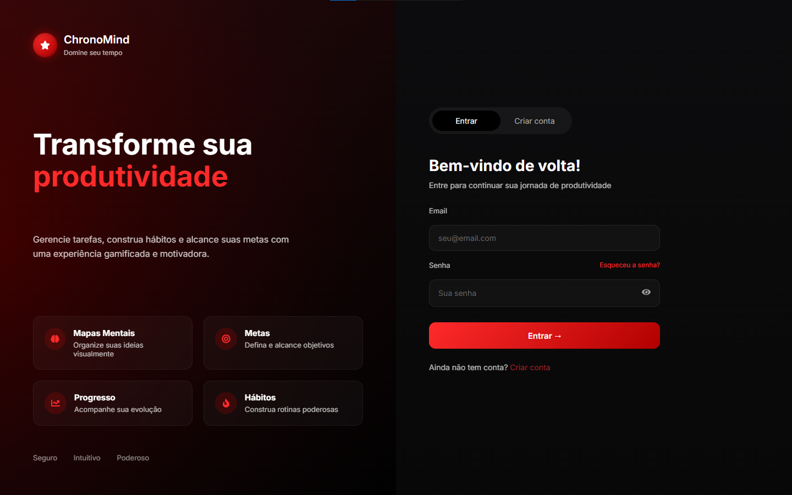

Ao entrar na aplicação, o usuário encontra uma interface limpa e direta:

O processo de registro inclui validação por código via API da Brevo, garantindo autenticação real e segura.

Antes de adotar a Brevo, testamos diversas abordagens SMTP tradicionais.
A solução atual foi escolhida por estabilidade e confiabilidade.

Tela de registro:

Após validação do código e confirmação da senha, a conta é criada e autenticada via JWT.

📊 Dashboard — O Panorama da Sua Evolução

  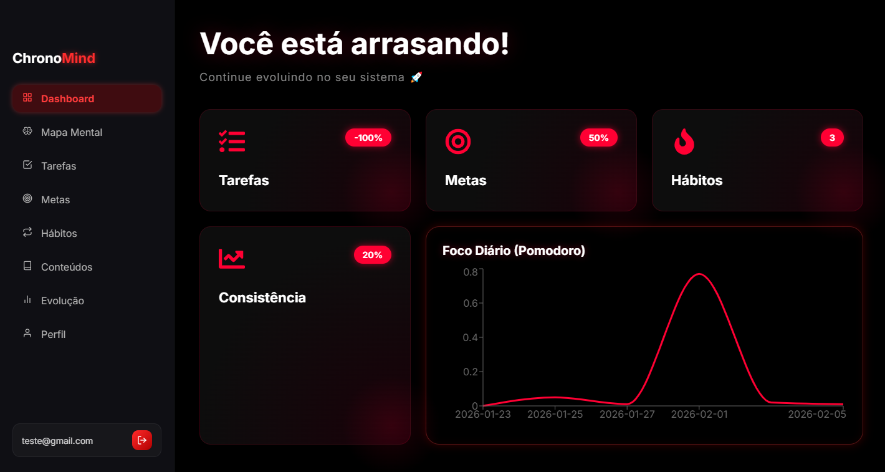

Assim que o usuário entra, ele não vê apenas números.
Ele vê contexto.

Aqui o sistema apresenta:

📈 Comparação com a semana anterior

🔥 Consistência de hábitos

🎯 Progresso de metas

✅ Evolução de tarefas

⏱️ Gráfico detalhado de horas estudadas

🏆 Sistema de conquistas desbloqueáveis

  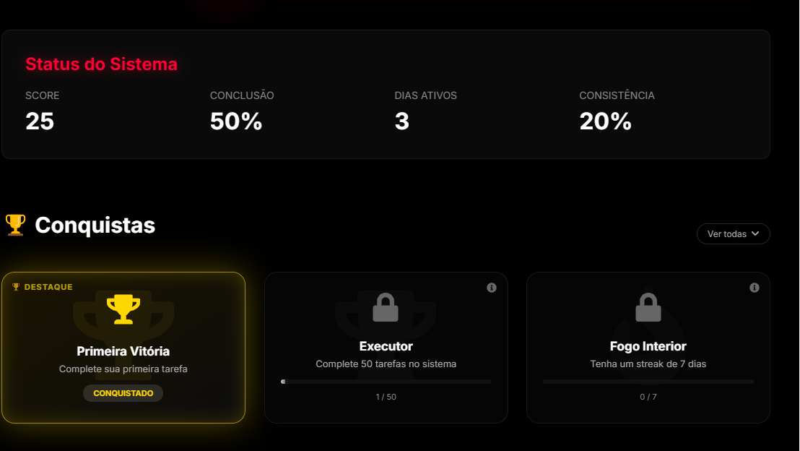

O objetivo não é apenas organizar.

É mostrar evolução.

O design foi pensado com gamificação estratégica e reforço visual imediato — produtividade precisa gerar recompensa.

🧠 MindMap — Onde Tudo se Conecta

Essa é a tela que transforma o ChronoMind em algo maior.

  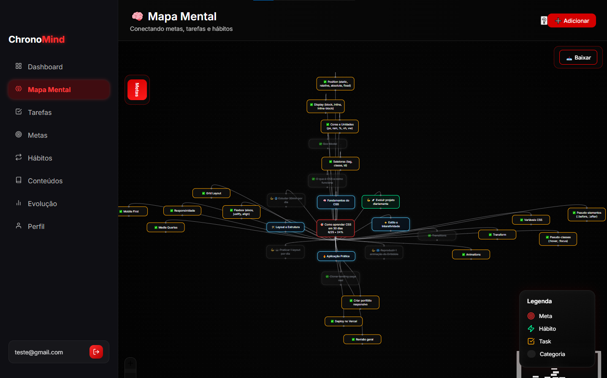

Aqui o usuário pode criar um verdadeiro motor de execução:

Meta central (ex: "Aprender CSS em 30 dias")

  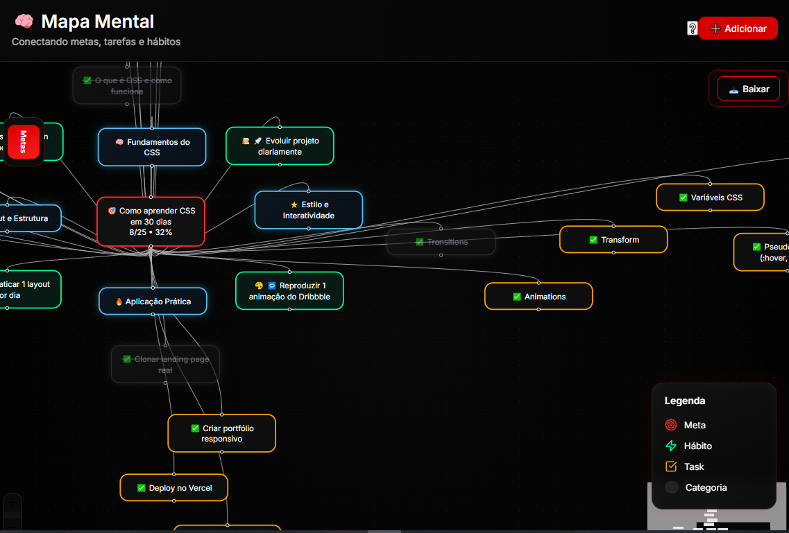

Categorias vinculadas

Tarefas como checkpoints

Hábitos diários conectados

Progresso calculado automaticamente

Tudo alimenta a porcentagem da meta principal.

Feedback visual reforça comportamento:

Hábito concluído hoje → fica levemente cinza

No dia seguinte → retorna ao verde

Tarefas concluídas → permanecem como marco de progresso

O mapa pode ser exportado como imagem.

Aqui o sistema deixa de ser organizador e vira estratégia.

🔥 TaskSwipe — Produtividade com Interação

A gestão de tarefas foi pensada para não ser monótona.

Existem dois modos:

📋 Modo Lista

  

Interface organizada, com edição, exclusão e filtros.

🎮 Modo Focus (inspirado em interações por gesto)

  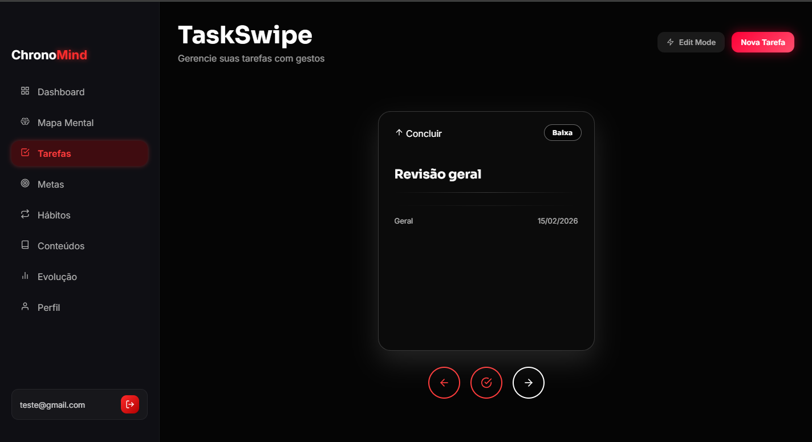

⬅️ Arrastar para esquerda → altera prioridade

⬆️ Arrastar para cima → conclui tarefa

➡️ Arrastar para direita → próxima tarefa

Prioridades são refletidas visualmente por intensidade de cor.

A ideia é tornar execução mais intuitiva e menos burocrática.

🎯 Metas — Progresso Mensurável

  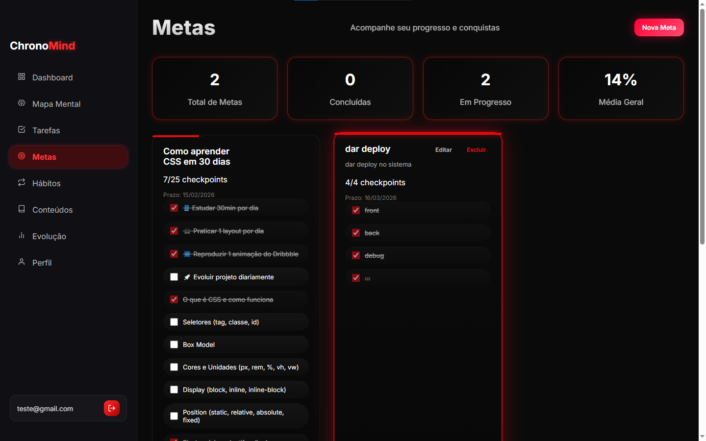

Aqui o usuário acompanha:

Total de metas

Metas concluídas

Em progresso

Média geral

Pode funcionar isoladamente ou integrada ao MindMap.

🔁 Hábitos — Consistência Diária

Sistema com:

Personalização por cores e emojis

  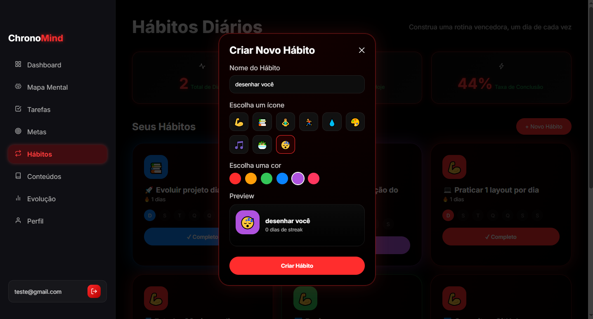

Reset automático diário

Estatísticas claras de consistência

Os hábitos alimentam diretamente a evolução das metas.

  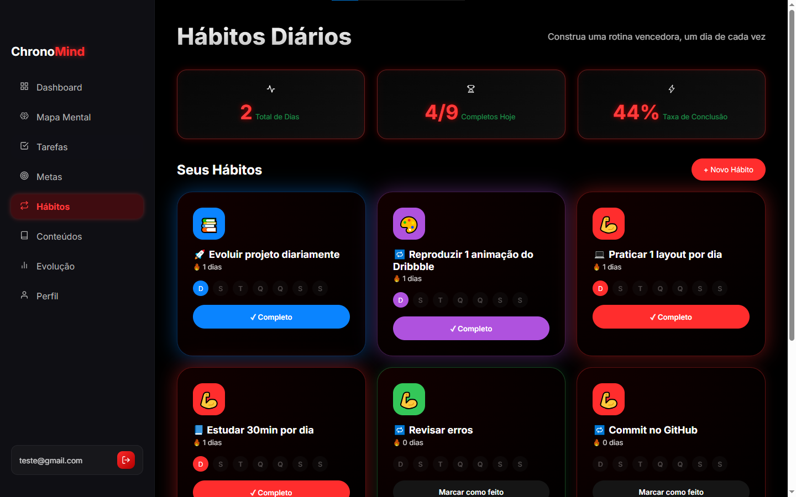

📚 Conteúdos — Foco + Inteligência Artificial

  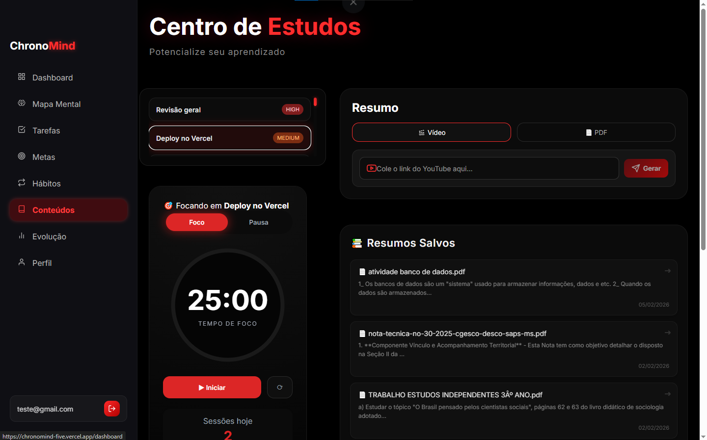

A tela de conteúdos é dividida em dois pilares: execução e compreensão.

⏱️ Pomodoro Inteligente

Sessões de 25 minutos

Pausas de 5 minutos

Vinculação direta com tarefas

Registro automático de foco diário

Ao finalizar:

Se concluiu → marca tarefa como feita

  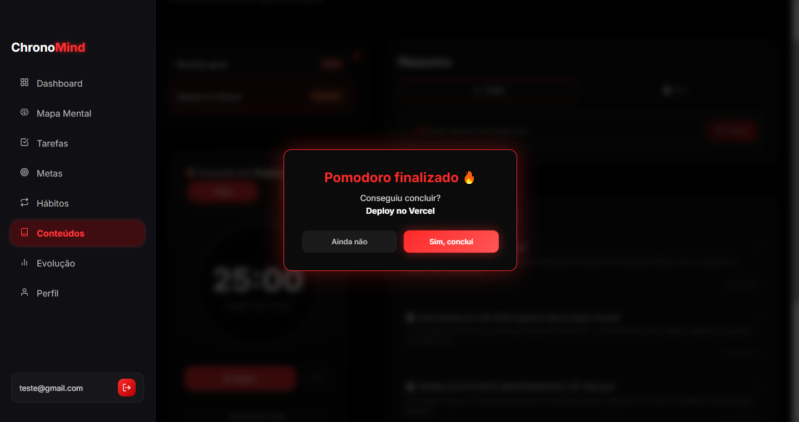

Se não → registra pomodoro executado

🤖 Sistema de Resumos com IA

Modelo utilizado:

Qwen/Qwen2.5-7B-Instruct

Após diversos testes com outros modelos, esse apresentou melhor qualidade de síntese e coerência.

🔎 Cache Inteligente por Hash

Cada resumo gerado:

Tem seu conteúdo convertido em hash

O hash é salvo no banco

Se outro usuário enviar o mesmo conteúdo:

O sistema compara o hash

Se existir → retorna instantaneamente do banco

Se não → chama a IA

Além disso, o sistema identifica o tipo de conteúdo antes de gerar o resumo:

Acadêmico → prompt específico

Currículo → prompt específico

Outros → prompt adaptado

Isso reduz custo computacional e melhora performance.

📈 Evolução — Dados que Contam uma História

  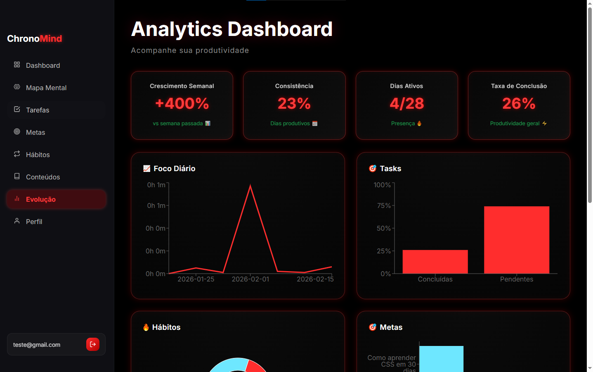

  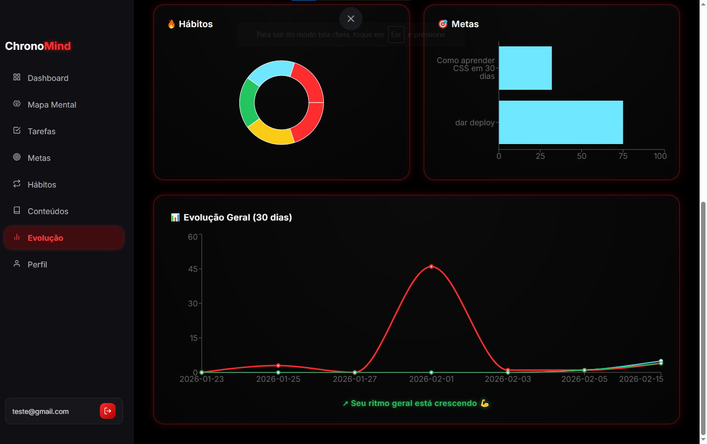

Produtividade sem análise é apenas esforço.

Aqui o usuário visualiza:

Crescimento semanal

Consistência

Dias ativos

Taxa de conclusão

Gráficos detalhados por área

Evolução geral dos últimos 30 dias

O objetivo é transformar dados em consciência.

🏗 Arquitetura Técnica
Frontend

React + Vite

React Router

Recharts

React Flow

Framer Motion

Three.js

PWA

Backend

Node.js

Express

MongoDB Atlas

JWT

Sistema de cache por hash

Integração com IA

Upload e processamento de PDFs

Deploy

Frontend:

Vercel

Backend:

Render

Banco:

MongoDB Atlas

Monitoramento:

UptimeRobot (rota de ping para evitar sleep)

👥 Equipe

Frontend:

Brayan (Colaborador)

Cecília (Colaborador)

Backend:

Eduardo (Colaborador)
GitHub: https://github.com/Edu-devCodes

Jackson (Colaborador)
GitHub: https://github.com/jacksongabrieldev-ops

📌 Status

Versão atual: MVP funcional em produção.

Arquitetura preparada para evolução.